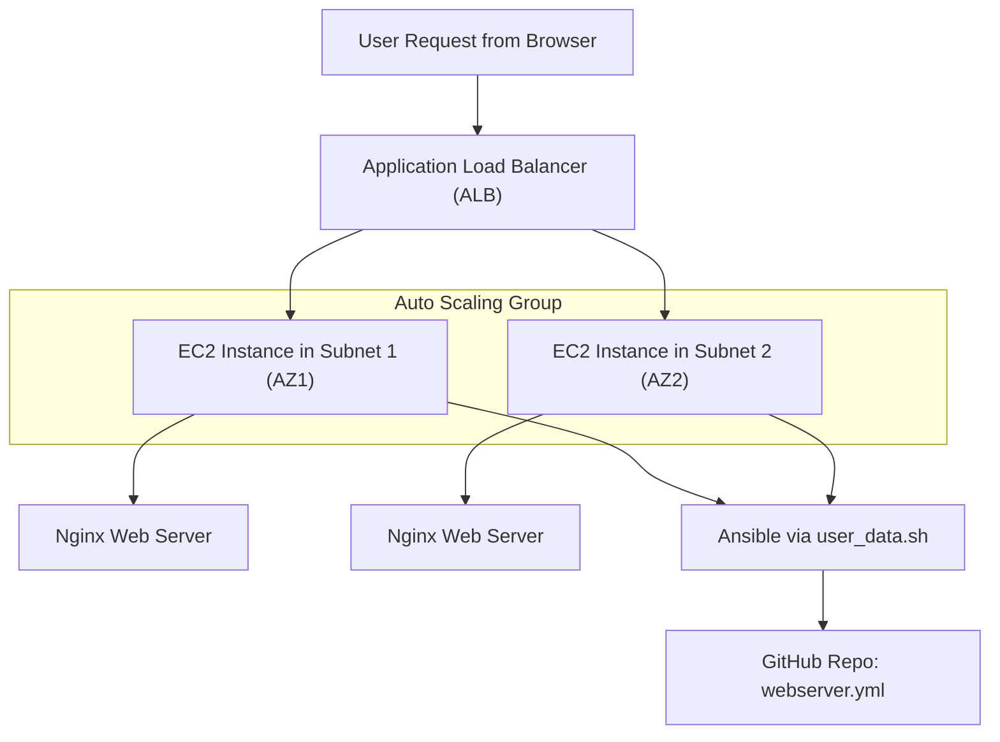

# 🚀 Automated Web Server Deployment with High Availability & Auto-Healing

This project uses **Terraform** and **Ansible** to deploy a highly available and auto-healing **Nginx web server** infrastructure on AWS.

## 📌 Project Highlights

- ✅ Infrastructure as Code (Terraform)
- ✅ Configuration Management (Ansible)
- ✅ AWS EC2, ALB, Launch Templates, Auto Scaling Groups
- ✅ Fault-tolerant, scalable, and self-healing setup
- ✅ Free-tier friendly

---

## 🛠️ Tech Stack

- **Terraform**
- **Ansible**
- **AWS Services:**
  - VPC, Subnets, Route Tables, Internet Gateway
  - EC2 Instances
  - Launch Templates
  - Auto Scaling Group (ASG)
  - Application Load Balancer (ALB)
  - Security Groups

---

## 🧱 Architecture Overview

- Custom **VPC** with 2 public subnets in different AZs
- EC2 instances deployed via **Launch Template**
- **Auto Scaling Group (ASG)** handles instance replacement & scaling
- **Application Load Balancer (ALB)** ensures high availability
- Instances configured with **Ansible** via user-data script to install and run Nginx

## 📁 Project Structure

terraform-aws-ha-webapp/
├── main.tf
├── user_data.sh
ansible-config/
├── webserver.yml
├── index.html
readme.md

